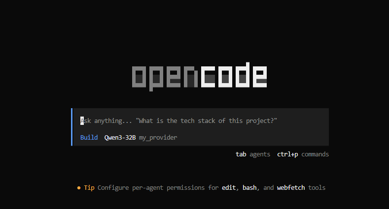

<p align="center">
  <h1 align="center">OpenCode Sentinel</h1>
</p>

<p align="center">
  <a href="https://opencode.ai">
    <picture>
      <source srcset="../packages/console/app/src/asset/logo-ornate-dark.svg" media="(prefers-color-scheme: dark)">
      <source srcset="../packages/console/app/src/asset/logo-ornate-light.svg" media="(prefers-color-scheme: light)">
      
    </picture>
  </a>
</p>

<p align="center">
  简体中文 | <a href="../README.md">English</a>
</p>

---

## 📖 简介

**OpenCode Sentinel** 是 OpenCode 的**安全增强版**，特别适合在**公司内网**或**无法访问互联网**的开发环境中使用。

相比原版，它允许你**只连接私有 AI 服务器**，完全切断外部网络。这不仅确保了代码数据绝对不出内网，还彻底解决了因外网连接不稳定导致的程序卡死问题。

**为什么选择 Sentinel 版本？**

- 📦 **断网也能装**：提供一键打包工具，把所有依赖都下载好，直接拷贝到内网机器上解压就能用。
- 🛡️ **严控外网访问**：支持“白名单”模式，你可以强制它**只允许连接公司内部的 AI 服务**，拦截其他所有不安全的网络请求。
- ⚡ **拒绝卡顿**：优化了网络连接逻辑，增加了智能的超时处理和重试机制，网络抖动不会导致程序界面假死。
- 🏢 **完美适配内网模型**：无缝支持接入企业私有部署的 DeepSeek、vLLM、Ollama 等大模型服务。

> **版本信息**：基于 [anomalyco/opencode](https://github.com/anomalyco/opencode) v1.1.28 ([commit dac7357](https://github.com/anomalyco/opencode/commit/dac73572e0ecf708d2968bb981e3fe65743dfbda)) 开发。

👉 **[查看详细变更日志](./MODIFICATIONS.md)**

## 🚀 离线部署流程

本项目提供了一键式打包工具，只需三个步骤即可在隔离环境中完成部署。

### 1. 准备构建环境
在一台**可访问互联网**的机器上（支持 Windows/macOS/Linux），安装基础依赖：
- **[Bun](https://bun.sh)**
- **[Node.js](https://nodejs.org/)**
- **克隆本项目**

```bash
git clone https://github.com/oneoflzx/opencode-sentinel.git; cd opencode-sentinel
```

### 2. 生成离线安装包
在**可访问互联网**的机器上运行打包脚本，自动拉取所有依赖并生成自包含的安装包：

```bash
bun offline-scripts/pack.ts
```
> 🎉 构建成功后，`offline-scripts/` 目录下将生成 `opencode-offline.tar.gz` 文件。

### 3. 目标环境安装
将 `opencode-offline.tar.gz` 传输至目标主机并解压。根据操作系统运行对应的安装脚本（脚本会自动配置 Node.js 环境及 PATH）：

| 操作系统 | 安装命令 | 说明 |
| :--- | :--- | :--- |
| **Linux / macOS** | `./install.sh` | 推荐使用 bash 运行 |
| **Windows** | `.\install.bat` | 或使用 PowerShell 运行 `install.ps1` |

解压后的目录结构参考：
```text
dir/
├── install.sh    # Linux/macOS 安装脚本
├── install.bat   # Windows 安装脚本
├── deps/         # 离线依赖包
├── bin/          # 可执行文件
└── node/         # 内置 Node.js 环境
```

---

## ⚙️ 配置指南

首次运行前，请在 `~/.config/opencode/opencode.json` 中配置安全策略与模型接入。

### 核心配置示例

```json
{
  "$schema": "https://opencode.ai/config.json",
  "network": {
    "policy": "whitelist",
    "whitelist": [
      "my-private-llm.com"
    ]
  },
  "provider": {
    "my_provider": {
      "options": {
        "baseURL": "https://my-private-llm.com/v1",
        "apiKey": "sk-private-key"
      },
      "models": {
        "qwen3-32b": { "name": "Qwen3-32B" }
      }
    }
  }
}
```

### 配置项说明

#### 网络策略 (`network`)
- **`policy`**:
  - `allow-all`: 允许所有出站连接（不推荐在敏感环境使用）。
  - `deny-all`: 拒绝所有出站连接。
  - `whitelist`: **推荐**。仅允许访问白名单内的域名。
- **`whitelist`**: 域名字符串数组，支持精确匹配及子域名匹配。

#### 模型服务 (`provider`)
沿用 OpenCode 标准配置格式。

---

## ▶️ 运行

安装配置完成后，即可直接启动：

```bash
# 确保环境变量已生效（或重新登录终端）
opencode
```

<p align="center">
  
</p>

## 📚 文档

- **修改详情**：请参阅 [MODIFICATIONS.md](./MODIFICATIONS.md) 了解详细的代码修改内容。
- **原始文档**：访问 [opencode.ai/docs](https://opencode.ai/docs)。

---

<p align="center">
  <i>Built with ❤️ for the open source community.</i>
</p>
